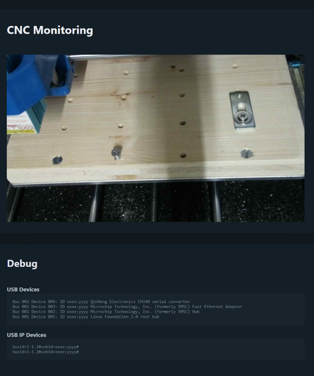

> More details: https://maruba.ch/blog/cnc-genmitsu-3018-proverv2-usbip

# Requirements

You can use this script basically with a lot of different cameras or Linux setups.
But the easiest way is to use the following setup:

-   Raspberry Pi 3/4 Model B with Raspberry Pi OS Lite
-   Raspberry Pi Camera Module V2
-   Python 3

## Installation

```bash
cd ~
git clone https://github.com/matthiasbaldi/genmitsu-3018-tools.git
cd genmitsu-3018-tools/cnc-cam

# Install dependencies
pip3 install -r requirements.txt

# Install service
sudo cp cnc-cam.service /lib/systemd/system/
sudo systemctl daemon-reload
sudo systemctl enable cnc-cam
sudo systemctl start cnc-cam
```

## Usage

Visit the following URL in your browser: http://<yourRaspberryPi-IP>:8000
The UI shows the camera stream and some debug information for the USB over IP connection.

> **Note:** You can change the port in the `cnc-cam.py` script as well as the orientation of the camera.


